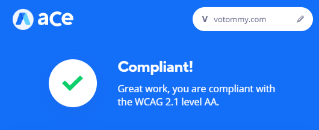

<h1>Tommy Portfolio Website</h1>
This site's goal is to showcase my front end abilities while also displaying my professional portfolio and resume. 
Complete with visual accessibility settings & full keyboard navigation / screen reader compatibility.
  
Website link: <a href="https://votommy.github.io/portfolio-website/" target="_blank" rel="noopener noreferrer">votommy.com</a>
  
My challenge for this project was to incorporate all my UX development skills and make the website as accessible as possible.
  

